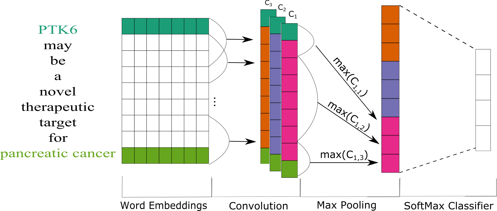

#Materials and Methods

##Dataset
Talk about dataset - Pubtator
Talk about preprocessing Pubtator
Talk about hand annotations for each realtion

## Label Functions
describe what a label function is and how many we created for each relation

## Training Models
### Generative Model
talk about generative model and how it works
### Word Embeddings
mention facebooks fasttext model and how we used it to train word vectors
### Discriminator Model
The discriminator model for this project is a piecewise convolutional neural network [@doi:10.18653/v1/D15-1203]. 
This network consists of using multiple kernel filters to essentialy create a n-gram model to predict sentences. 
We used three different kernels of size 7 for the convolutional layer. 
The next layer we used is a fully connected layer that with 300 neurons for the first layer, 100 for the second layer and 50 for the last layer. 

### Discriminator Model Calibration
Often many tasks require a machine learning model to output reliable probability predictions. 
This means if a model were to assign a class label with 80% probability, that class should appear 80% of the time.
Typically, deep learning models tend to be poorly calibrated [@arxiv:1706.04599; @arxiv:1807.00263].
These models are usuall over confidenent in their prediction.
As a result, we calibrated our piecewise convolutional neural network using temperature scaling. 
Temperature scaling uses a parameter T to scale each value of the logit vector before being passed into the softmax (SM) function.

$$\sigma_{SM}(\frac{z_{i}}{T}) = \frac{\exp(\frac{z_{i}}{T})}{\sum_{i}\exp(\frac{z_{i}}{T})}$$

The optimial T is found by minimizing the negative log likelihood (NLL) of a validation set.
The benefit of using this method is the model becomes more reliable and the accuracy of the model doesn't change [@arxiv:1706.04599].

## Experimental Design
talk about sampling experiment
