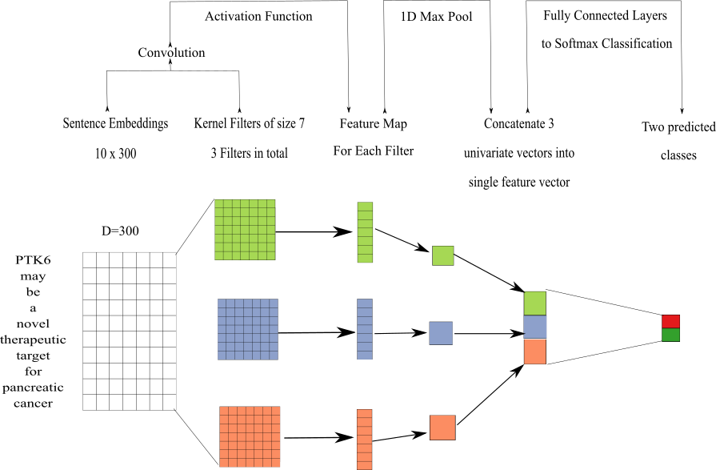

#Materials and Methods

##Dataset
Talk about dataset - Pubtator
Talk about preprocessing Pubtator
Talk about hand annotations for each realtion

## Label Functions
describe what a label function is and how many we created for each relation

## Training Models
### Generative Model
talk about generative model and how it works
### Word Embeddings
mention facebooks fasttext model and how we used it to train word vectors
### Discriminator Model
The discriminator model is designed to improve off of the predctions from the generative model.
We used a convolutional neural network with multiple filters as our discriminator model.
This network uses multiple filters with fixed widths of 300 dimensions and can have varying heights (Figure 1).
For our model we each filter at a fixed height of 7, because this provided the best performance in terms of relationship classification [@arxiv:1510.03820].
We trained this model for 20 epochs using the adam optimizer [@arxiv:1412.6980] with a learning rate of 0.001.
This optimizer had beta values of 0.9 and 0.99 respectively.
We added a L2 penalty on the network weights to prevent overfitting.
Lastly, we added a dropout layer (p=0.25) between the fully connected layer and the softmax layer.

Figure 1. This is the architecture of our convolutional neural network. We treat the sentence matrix like an image and perform a convolution step using multiple filters. 
These filters generate a feature map that is sent into a maximum pooling layer. 
This layer extracts the largest feature in each of these maps. The extract features are concatenated into a singular vector that will be passed into a fully connected network. 
The fully connected network has 300 neurons for the first layer, 100 neurons for the second layer and 50 neurons for the last layer. 
From the fully connected network the last step is to generate predictions using the softmax layer.

### Discriminator Model Calibration
Often many tasks require a machine learning model to output reliable probability predictions. 
This means if a model were to assign a class label with 80% probability, that class should appear 80% of the time.
Typically, deep learning models tend to be poorly calibrated [@arxiv:1706.04599; @arxiv:1807.00263].
These models are usually over-confidenent in their predictions.
As a result, we calibrated our convolutional neural network using temperature scaling. 
Temperature scaling uses a parameter T to scale each value of the logit vector (z) before being passed into the softmax (SM) function.

$$\sigma_{SM}(\frac{z_{i}}{T}) = \frac{\exp(\frac{z_{i}}{T})}{\sum_{i}\exp(\frac{z_{i}}{T})}$$

We found the optimial T by minimizing the negative log likelihood (NLL) of a held out validation set.
The benefit of using this method is the model becomes more reliable and the accuracy of the model doesn't change [@arxiv:1706.04599].

## Experimental Design
talk about sampling experiment
